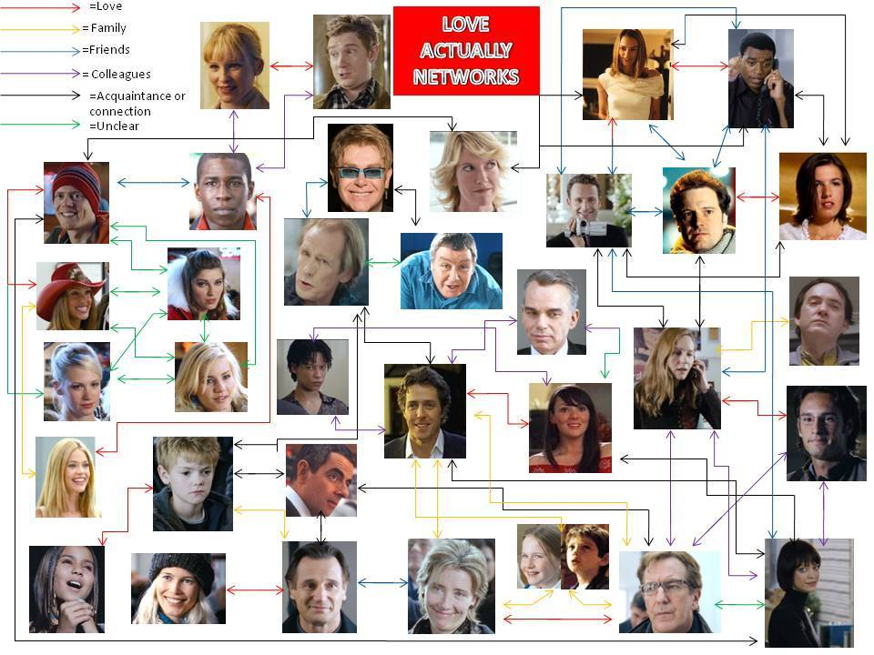

# Big-O 102: Data Structures and Beyond

### Objectives
*After this lesson, students will be able to:*
- Identify common data structures
  - Linked lists, Trees, Heaps, Tries, Graphs
- Be familiar with their common methods
  - And be able to determine their run-times
- Know use-cases for each data structure discussed

### Preparation
*Before this lesson, students should:*
- Have practice reading/writing pseudocode
- Be familiar with [Big-O](https://github.com/aribrenner/Big-O-101) and common [run-times](https://github.com/aribrenner/Big-O-101#common-run-times)

## Linked Lists


Linked lists are used to represent an ordered set.  They are similar to arrays but do NOT live contiguously in memory.

We have a reference to the _head_ (and possibly the _tail_).  Each node has a reference (or pointer) to the _next_ node.

> In a doubly-linked-list each node also has a reference to the _prev_ node.

We cannot get an element at a given index in constant time.  We must iterate over the list.

We can however insert/remove an element to the head in constant time.  This is not the case for an array.  (Hence `shift`/`unshift` )

### Common use-cases

Linked Lists are often used to represent [Stacks][stacks] and [Queues][queues].
> Why might we prefer to use linked list to implement a stack or queue?  Why not an array?

### Discussion

Why would we choose to use a linked list over an array?  What are the advantages and disadvantages?

## Trees

A tree is a collection of nodes, where each node has some number of _children_.  We cannot see every node at once, but we do have a pointer to the _root_ node.

_Leaf_ nodes are those that have no children.

Trees can be used to represent a family tree (where the old people are on top), or a file structure.

### Traversal

We can traverse a tree using **Depth first search** or **Breadth first search**.  More on this below.


## Binary Search Trees


A binary tree is a tree such that every node has at most 2 children.

A binary _search_ tree (BST) is one such that:

* The value of every _left_ child is _less_ than that of its parent
* The value of every _right_ child is _greater_ than that of its parent

This makes searching for elements in a BST very fast.

To **insert** into a BST, we compare the new val with the root value.  If it is less than the root, we repeat the process for the left subtree.  If it is greater than the root we repeat the process for the right subtree.  We keep repeating this process until our node ends up on the bottom.

Look up how to **remove** a node if you are interested ;)

### Traversal

#### Depth first search
```
Tree.instanceMethods.traverse(callback) :=
  left.traverse(callback) if hasLeftChild?
  callback(value)
  right.traverse(callback) if hasRightChild?
```

The above pseudocode is called _in_-order traversal.  Check out pre-order and post-order as well.

#### Breadth first search
This is a little more complicated.  Look it up if you are interested ;)

### Discussion
How quickly (in Big-O) can we find an element in a BST with `n` elements?

How quickly can we find the min element?  The max element?

> Check out my [Typescript](https://github.com/aribrenner/Big-O-102/blob/master/bst/binary-search-tree.ts) and compiled [Javascript](https://github.com/aribrenner/Big-O-102/blob/master/bst/binary-search-tree.js) implementations

## AVL Trees

An AVL (named for its inventors) tree is a _self-balancing_ binary search tree.  You do not need to understand how these work but know that they exist.

Self-balancing means that whenever we insert or remove a node, we re-organize the rest of tree so that no node with 0 or 1 children hangs more than 1 level below another.


### Discussion
Why would we want a self-balancing tree? Is it worth the implementation?  Are the run-times different than a tree that is not self-balancing?

## (Min) Heap

A Min Heap is binary tree such that the value of every node is less than the value of all of its children.  Thus, the smallest value is always the root of the tree.

They are used when we want to keep track of the smallest element in a set.

> You can probably guess what a Max Heap is


#### Reading
To get the min element we just look at the root. (Duh)

#### Inserting
To insert elements, we add a node to first available position (the bottom-left) and "bubble it up". This means we keep swapping it with its parent until the value of the node is no longer larger than the parent.

> How do we know inserting in this way will always leave us with a Min Heap?

#### Extracting
To extract the min element we replace the root with the last element (the one in the bottom-right position).  Then we keep bubbling the element down.  This means we keep swapping it with its smaller child as long as the child is smaller than it.

> How do we know extracting in this way will always leave us with a Min Heap?

### Using arrays to represent heaps

A heap is a _complete_ binary tree.  That is, only the last level may not be full, with all leaf nodes on the left.  Because of this we can use arrays to represent each node of the tree.  Let's look at the example from above to see out this works.

For each element at index `i`, its children are at `2*i` and `2*i + 1`.  Even simpler, the parent of any element at index `i` is at index `i/2` (rounding down).  This works all long as we put a _dummy_ at index 0.  (Thus the root is at index 1)

### Other use-cases

Besides keeping track of a min/max in set, heaps can be used keep track of _medians_.  To do this we keep half of our elements in a _min_ heap and the other half in a _max_ heap.  [High-level implementation here](https://stackoverflow.com/a/15319593)

Ever hear of [heap sort](https://en.wikipedia.org/wiki/Heapsort)? This is a very efficient and easy algorithm for sorting arrays. Fun!


### Discussion
What would be the run-time of `insert`? `get_min?`? `extract_min`?

> Check out my [Ruby implementation here](https://github.com/aribrenner/Big-O-102/blob/master/heap/min_heap.rb)

## Tries

Pronounced _try_ or _tree_ depending on who you ask.  The word comes from re<i>trie</i>val but many pronounce it like _try_ to distinguish from trees.

Anyway. This is a Trie


Tries are often to represent a set of words.  The children of each node are the next letter of a word in our set.

> Check out my [Ruby implementation here](https://github.com/aribrenner/Big-O-101/blob/master/trie/trie.rb)


### Discussion
Let's assume we have a `trie` of `n` words where the longest words of length `m`.

What would be the run-time of `includes?`? `insert`?  What about initializing our trie?

Why would we use a trie compared to a hash or BST?  How much _space_ do we need compared to other data structures.

## Graphs



A Graph is a collection of _nodes_ (or _vertices_) and _edges_.  They can represent a network where each node is an element and each edge represents a _connection_ between those elements.

Types of graphs:
* **Directed**: Graphs can be _directed_ or _undirected_
  - directed: a graph of twitter users and followers
  - undirected: a graph of facebook users and friends

* **Weighted**: Graphs can also have weights
  - A graph of cities and distances between them may bed _weighted_
  - A weighted graph can also have direction.

* **Mutli-edged**: A _multigraph_ can have multiple edges between nodes.

Depending on the complexity of what we want to represent, many different types of graphs will do the trick.

Depending on the type of graph, many different types of object can represent it.

### Discussion

What kind of networks can we use a graph to represent?  What type of graph would these be?

What kind of objects could we use to represent a graph?  What if has weights? What if it has direction?

How can we represent a tree using a graph?  How can we represent a linked list using a graph?

> Like graphs? Like money? Find a poly-time solution to [Traveling Salesman](https://en.wikipedia.org/wiki/Travelling_salesman_problem) and win a million bucks!


## Lab

;)

## Resources

Leaving it out this time.  There are many good resources out there for this material.  Google, Wikipedia, etc.  Practice self discovery!

> It is OK to use Wikipedia to get a basic level of understanding of data structures and algorithms.  Why?  Because you can _prove_ to yourself that the information is correct!  For a more advanced level of understanding, however, books and published papers are probably the way to go.

## Conclusion
- Why do we care about how we represent data?
- How do we determine which data structures to use for different purposes?
- How can we determine the run-time of data structure's method?


[stacks]: https://en.wikipedia.org/wiki/Stack_(abstract_data_type)
[queues]: https://en.wikipedia.org/wiki/Queue_(abstract_data_type)
